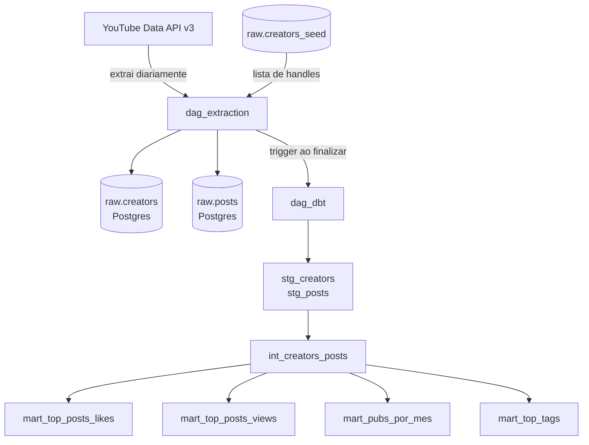

# Pipeline de Dados: Creators e Posts do YouTube

## Visao Geral

Este projeto implementa um pipeline de dados para coleta e atualizacao continua de informacoes de criadores de conteudo do YouTube e seus videos. Os dados sao extraidos via YouTube Data API v3, armazenados em um banco Postgres e transformados com DBT para gerar analises de desempenho por creator.

---

## Orquestrador: Apache Airflow

O Airflow foi escolhido pelos seguintes motivos:

- **Maturidade**: e o orquestrador mais adotado no mercado para pipelines de dados batch, com grande comunidade e documentacao
- **Visibilidade**: a interface web permite acompanhar o historico de execucoes, logs de cada task e o status do pipeline em tempo real
- **Dependencias entre DAGs**: o operador `TriggerDagRunOperator` permite que a DAG de extracao dispare a DAG de transformacao de forma desacoplada, sem criar dependencias rigidas entre os dois processos
- **Controle de falhas**: suporta retry automatico por task, callbacks de erro e envio de alertas por email nativamente
- **Facilidade local**: com Docker Compose e possivel subir um ambiente completo em minutos, sem infraestrutura externa

---

## Arquitetura



---

## Modelagem de Dados

### Camada Raw (fonte de dados brutos)

**raw.creators_seed**
Tabela de entrada com a lista de creators a monitorar. Alimentada manualmente.

| Coluna   | Tipo         | Descricao                              |
|----------|--------------|----------------------------------------|
| id       | serial PK    | Identificador interno                  |
| handle   | varchar(100) | Handle do canal no YouTube (@felipeneto) |
| name     | varchar(255) | Nome legivel do creator                |
| active   | boolean      | Se deve ser incluido nas execucoes     |
| added_at | timestamp    | Data de inclusao na seed               |

**raw.creators**
Dados dos canais resolvidos via API (handle -> channel_id).

| Coluna     | Tipo         | Descricao                        |
|------------|--------------|----------------------------------|
| id         | serial PK    | Identificador interno            |
| handle     | varchar(100) | Handle do canal (sem @)          |
| channel_id | varchar(100) | ID permanente do canal no YouTube|
| title      | varchar(255) | Nome oficial do canal            |
| loaded_at  | timestamp    | Ultima atualizacao               |

**raw.posts**
Videos/posts brutos de cada creator.

| Coluna      | Tipo         | Descricao                              |
|-------------|--------------|----------------------------------------|
| id          | serial PK    | Identificador interno                  |
| video_id    | varchar(100) | ID unico do video no YouTube           |
| channel_id  | varchar(100) | FK para raw.creators.channel_id        |
| title       | text         | Titulo do video                        |
| published_at| timestamp    | Data e hora de publicacao              |
| views       | bigint       | Total de visualizacoes                 |
| likes       | bigint       | Total de likes                         |
| tags        | text[]       | Array de tags do video                 |
| loaded_at   | timestamp    | Ultima atualizacao                     |

### Camada Staging (limpeza e padronizacao)

**stg_creators**: seleciona e renomeia colunas de `raw.creators`. Materializada como view.

**stg_posts**: seleciona colunas de `raw.posts`, filtra registros sem `published_at` e adiciona a coluna calculada `year_month` (formato `YYYY/MM`). Materializada como view.

### Camada Intermediate (integracao)

**int_creators_posts**: join entre `stg_creators` e `stg_posts` via `channel_id`. Centraliza todos os dados necessarios para as analises. Materializada como view.

### Camada Mart (analises finais)

Todas as tabelas mart sao materializadas como tabelas fisicas no Postgres.

| Tabela                 | Descricao                                           |
|------------------------|-----------------------------------------------------|
| mart_top_posts_likes   | Top 3 videos por likes de cada creator              |
| mart_top_posts_views   | Top 3 videos por views de cada creator              |
| mart_pubs_por_mes      | Quantidade de publicacoes por mes, com 0 nos vazios |
| mart_top_tags          | Top 3 tags mais usadas por creator                  |

### Diagrama de Relacionamento

```
raw.creators_seed
       |
       | (lido pela DAG)
       v
raw.creators ----------+
                       |
raw.posts  ------------+---- int_creators_posts ---- mart_*
     (channel_id FK)
```

---

## Extracao de Dados

### Extracao Inicial

A extracao inicial e a diaria seguem o mesmo processo:

1. Le os handles ativos de `raw.creators_seed`
2. Para cada handle, chama `channels.list?forHandle=@handle` para obter o `channel_id` permanente
3. Busca o ID da playlist de uploads do canal via `channels.list?part=contentDetails`
4. Percorre a playlist com `playlistItems.list` filtrando videos publicados a partir de `2026-01-01`
5. Para cada lote de ate 50 videos, busca estatisticas e tags via `videos.list?part=statistics,snippet`
6. Faz upsert nas tabelas `raw.creators` e `raw.posts`

A logica de upsert garante que re-execucoes nao geram duplicatas e que views e likes sao sempre atualizados com os valores mais recentes.

### Atualizacoes Continuas

A DAG `dag_extraction` roda diariamente as 06h. A cada execucao:

- Novos videos sao inseridos
- Views e likes de videos existentes sao atualizados
- Novos creators podem ser adicionados manualmente na tabela `raw.creators_seed`

---

## Etapas do Pipeline

```
1. EXTRACAO (dag_extraction)
   - Le creators_seed
   - Chama YouTube API
   - Upsert em raw.creators e raw.posts

2. TRIGGER
   - Ao concluir com sucesso, dispara dag_dbt via TriggerDagRunOperator

3. TRANSFORMACAO (dag_dbt)
   - dbt run: executa todos os models em ordem (stg > int > mart)
   - dbt test: valida unicidade e nulos nas colunas criticas

4. DISPONIBILIZACAO
   - Tabelas mart ficam disponiveis no Postgres para consulta
```

---

## Monitoramento e Qualidade

### Monitoramento do Pipeline

- **Airflow UI** (`localhost:8080`): historico de execucoes, duracao de cada task, logs detalhados e status por DAG
- **Alertas por email**: qualquer falha em qualquer task de qualquer DAG dispara um email para o administrador com o nome da DAG, task, excecao e link direto para o log

### Qualidade dos Dados (DBT Tests)

Apos cada transformacao, o `dbt test` valida:

| Coluna         | Modelo          | Teste         |
|----------------|-----------------|---------------|
| video_id       | stg_posts       | unique, not_null |
| channel_id     | stg_creators    | unique, not_null |
| handle         | stg_creators    | unique, not_null |
| video_id       | int_creators_posts | unique, not_null |
| handle         | mart_top_*      | not_null      |
| publicacoes    | mart_pubs_por_mes | not_null    |

Se qualquer teste falhar, a task `dbt_test` e marcada como erro e o email de alerta e enviado.

---

## Boas Praticas

### Gitflow

O projeto segue o fluxo basico do Gitflow:

- `main`: codigo estavel e testado
- `develop`: integracao de novas features
- `feature/nome`: desenvolvimento de funcionalidades isoladas
- `hotfix/nome`: correcoes urgentes em producao

Pull requests para `main` exigem revisao antes do merge.

### Principios Aplicados

**Idempotencia**: todas as insercoes usam `ON CONFLICT DO UPDATE`, o que significa que rodar a DAG multiplas vezes no mesmo dia nao gera duplicatas nem inconsistencias.

**Separacao de responsabilidades**: a extracao (DAG 1) e a transformacao (DAG 2) sao DAGs independentes. Uma falha na transformacao nao impede que a extracao ocorra no dia seguinte.

**Segredos fora do codigo**: credenciais (API key, senhas, tokens SMTP) ficam no `.env`, que esta no `.gitignore` e nunca e commitado.

**Rastreabilidade**: todas as tabelas raw possuem coluna `loaded_at` com o timestamp da ultima carga, permitindo auditar quando cada registro foi atualizado.

**Modularidade do DBT**: cada model tem uma unica responsabilidade. A camada mart nunca acessa `raw` diretamente, sempre passando por `staging` e `intermediate`.

---

## Como Rodar Localmente

**Pre-requisitos**: Docker, Docker Compose

```bash
# 1. Copiar e preencher as variaveis de ambiente
cp .env.example .env

# 2. Inicializar o banco e o usuario do Airflow
docker compose up airflow-init

# 3. Subir o ambiente
docker compose up -d airflow-webserver airflow-scheduler

# 4. Acessar o Airflow
# URL: http://localhost:8080
# Usuario: admin
# Senha: admin
```

Ativar e disparar a `dag_extraction` manualmente na interface. Ao concluir, ela dispara automaticamente a `dag_dbt`.

---

## Estrutura do Projeto

```
part2/
├── docker-compose.yml
├── .env.example
├── CREDENTIALS.md
├── requirements.txt
├── docker/
│   ├── init_db.sql
│   └── airflow-requirements.txt
├── extraction/
│   ├── youtube_client.py
│   ├── extract_and_load.py
│   └── test_extraction.py
├── dags/
│   ├── dag_extraction.py
│   └── dag_dbt.py
└── dbt/
    ├── dbt_project.yml
    ├── profiles.yml
    └── models/
        ├── staging/
        │   ├── sources.yml
        │   ├── schema.yml
        │   ├── stg_creators.sql
        │   └── stg_posts.sql
        ├── intermediate/
        │   ├── schema.yml
        │   └── int_creators_posts.sql
        └── mart/
            ├── schema.yml
            ├── mart_top_posts_likes.sql
            ├── mart_top_posts_views.sql
            ├── mart_pubs_por_mes.sql
            └── mart_top_tags.sql
```
